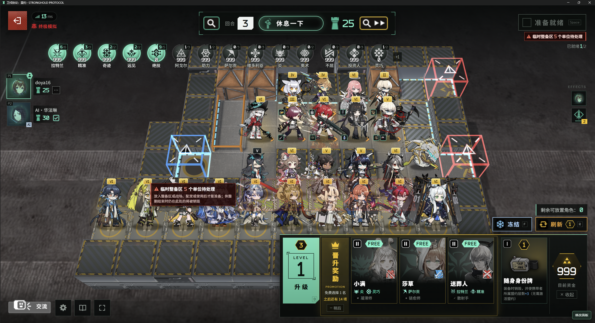
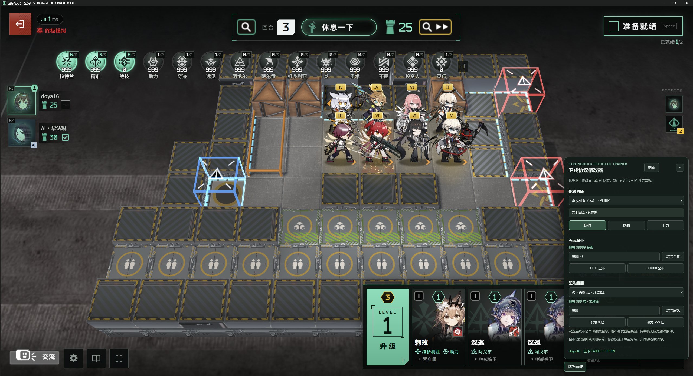
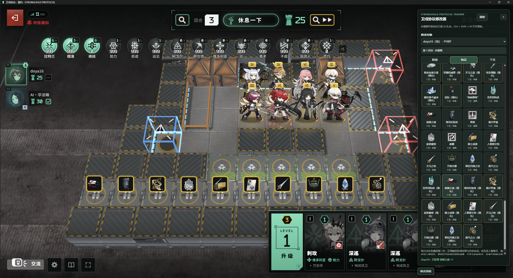
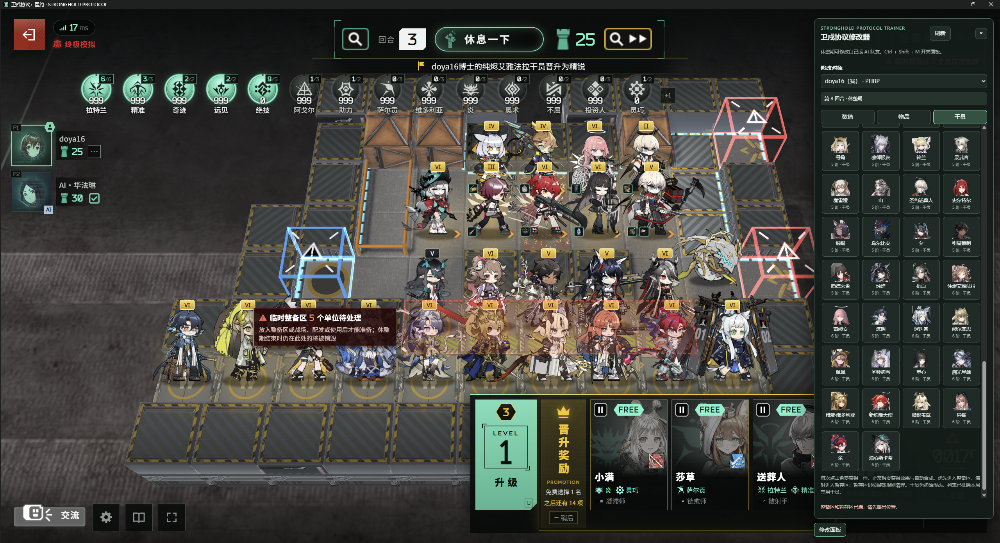

<!-- README language switch -->
[](README.md) [](README.en.md)
<!-- /README language switch -->

# Stronghold Protocol Trainer | Arknights: Stronghold Protocol Local Trainer

**Want to try a complete team without repeatedly refreshing the shop?** Add a local trainer panel to [Stronghold Protocol / 卫戍协议：盟约](https://github.com/sganggs/Stronghold-Protocol): set gold, adjust covenant stacks, and click icons to obtain items and operators available in the current match.

[Download the installer](https://github.com/Doya16/Stronghold-Protocol-Trainer/releases/latest) · [Installation guide](#install) · [In-game feature showcase](#features) · [Community team references](#community) · [Report an issue](https://github.com/Doya16/Stronghold-Protocol-Trainer/issues)



*In-game screenshot provided by Doya16: round 3 of Ultimate Simulation, with Laterano (拉特兰), Precision (精准), Miracle (奇迹), Foresight (远见), and other covenants at 999 stacks, alongside operators on the field and in the preparation area.*

**An unofficial fan extension for local testing and personal, noncommercial entertainment only. Do not use game assets for profit.** Game assets belong to Hypergryph / Yostar and their respective rights holders. This project does not include the base game or its asset package. See [NOTICE.md](NOTICE.md).

| What you can do | How |
| --- | --- |
| Set gold | Enter 0–99999, or click +100 / +1000 |
| Adjust covenant stacks | Select a covenant allowed in the match and set 0–999 stacks |
| Obtain items for free | Search or filter, then click an icon to obtain one item |
| Obtain operators for free | The list excludes operators banned in the current match; each click grants one |
| Modify yourself / an AI teammate | Switch targets in **修改对象** (target) |
| Launch and close with one click | Use the dedicated shortcuts created in the base game directory |

The game and installer use Chinese labels. This guide keeps key labels in Chinese alongside English explanations so you can match them to the interface.

<a id="install"></a>
## Illustrated installation guide

### Step 1: Prepare the base game and trainer

| Requirement | Download / check |
| --- | --- |
| Windows x64 | Supported by the current graphical installer |
| Base game **v0.1.3 complete package** | Download `Stronghold-Protocol-v0.1.3.zip` from the [base game v0.1.3 release](https://github.com/sganggs/Stronghold-Protocol/releases/tag/v0.1.3) |
| Node.js **22 or 24** | [Official Node.js download](https://nodejs.org/zh-cn/download); an existing `runtime/node.exe` in the game directory also works if its version meets the requirement |
| Chrome or Edge | Used to launch a dedicated game window |
| Trainer installer | Download `Stronghold-Protocol-Trainer-v0.2.0-win-x64.zip` from [trainer Releases](https://github.com/Doya16/Stronghold-Protocol-Trainer/releases/latest) |

On the trainer release page, find **Assets** near the bottom and choose the attachment ending in **`win-x64.zip`**. `Source code (zip)` and `Source code (tar.gz)` are development source archives, not ready-to-run installers.

<details>
<summary>Show where to download (Assets is at the bottom of the release page)</summary>


</details>

### Step 2: Extract everything and confirm that the base game runs

Fully extract each ZIP into a regular folder. Do not run an EXE from an archive preview. Use a short, writable path such as `D:\Games\Stronghold-Protocol`, preferably outside OneDrive-synced folders.

First read **the base game's own `README.md` → 快速开始 → 整合包** (Quick Start → Complete Package), prepare Node.js, and confirm that the original game opens through `scripts\start-windows.bat`. The complete package contains the base game's dependencies and assets; the trainer does not download missing files for you.

**Select the directory that directly contains `package.json` in the installer.** If extraction creates two nested folders with the same name, select the inner one.

```text
D:\Games\Stronghold-Protocol\       ← Select this directory in the installer
├─ package.json
├─ README.md
├─ server\
├─ public\
├─ data\
├─ node_modules\
└─ scripts\

D:\Downloads\Stronghold-Protocol-Trainer-v0.2.0-win-x64\
└─ Stronghold-Protocol-Trainer-Setup.exe   ← Double-click this installer
```

### Step 3: Select the directory and install / enable

1. Close the game and server windows used for the initial check.
2. Double-click **`Stronghold-Protocol-Trainer-Setup.exe`**.
3. Paste the base game root path, or click **浏览…** (Browse) to select it. The screenshot shows an example; use your own path.
4. Click **安装 / 启用** (Install / Enable). Wait for the success message in the status area, then click **启动游戏** (Launch Game).


After installation, the game directory contains these additional entries:

```text
sp-local-tools\                         ← Trainer files
卫戍协议本地修改器 - 启动.lnk            ← Launch the trainer here next time
卫戍协议本地修改器 - 关闭并清理.lnk      ← End this game session and clean up
```

Administrator privileges are not required, but the directory must be writable. The installer checks the base game version, Node.js, browser, and required files. If it reports missing components, add them as instructed and run installation again.

### Step 4: Launch through the trainer

For the first launch, click **启动游戏** (Launch Game) in the installer. Later, double-click **卫戍协议本地修改器 - 启动** in the base game directory.

At the login screen below, enter your Doctor codename and click **开始** (Start). The **修改面板** (Trainer Panel) button at the bottom right confirms that the extension loaded for this session.


### Step 5: Start a match and enter the rest phase

For a first run, choose **独立模拟 → 标准模拟 → 开始独立模拟** (Solo Simulation → Standard Simulation → Start Solo Simulation). Then click **开始模拟 → 准备就绪 → 确认选择** (Start Simulation → Ready → Confirm Selection), and wait until the top of the screen says **休息一下** (Take a Break).


You can also add AI teammates in alliance simulation. **The trainer entry point listens only on local address `127.0.0.1`.** The base game's remote / LAN multiplayer features do not mean this trainer provides remote modification capabilities.

### Step 6: Open the panel and confirm the target

Click **修改面板** (Trainer Panel) at the bottom right, or press **Ctrl + Shift + M**. Confirm that the status shows the current round and **休整期** (rest phase), then select yourself or the intended AI in **修改对象** (target) before using the three tabs.

| Tab | Quick start | Where to check the result |
| --- | --- | --- |
| **数值** (Values) | Enter gold → **设置金币** (Set Gold); choose a covenant → **设为 999 层** (Set to 999 Stacks) | Success message at the bottom, game funds, and covenant bar |
| **物品** (Items) | Filter by type / tier → click an item icon | Success message, preparation area, or overflow area |
| **干员** (Operators) | Search a name → click a portrait | Success message and preparation area; matching copies combine into an elite automatically |

Changes are unavailable while ready, in combat, or after the target player has been eliminated. Cancel readiness or wait for the next rest phase.

<a id="features"></a>
## In-game feature showcase

The four in-game screenshots at the top and in this section were provided by **Doya16**, with their original visuals preserved. They show the full team, gold and covenant stacks, item grants, and the operator list with preparation area status. Click an image to view the original.

### Gold and covenants: 99999 gold and multiple 999-stack covenants

In **数值** (Values), enter the desired amount and click **设置金币** (Set Gold), or use **+100 金币 / +1000 金币**. Funds update in the game UI. Purchases, shop refreshes, and round income still follow the base game's rules.

Select a covenant and click **设为 999 层** (Set to 999 Stacks). In the screenshot, the panel shows **99999 gold**, the success message reads **金币 14006 → 99999** (gold 14006 → 99999), and several covenants at the top show **999 stacks**.



**Stack count and activation conditions are separate.** Setting 999 stacks does not complete your team composition or grant rewards that would have accumulated at earlier stack levels. Meet the covenant's activation conditions first, then check its effect.

The selected **炎** (Yan) covenant illustrates **999 stacks while inactive**. Highlighted and greyed-out covenants still determine activation from the actual team composition.

### Items: click an icon to obtain one

Open **物品** (Items) and search by name, ID, or description, or filter by **tier + normal equipment / enhanced equipment / consumables**. The screenshot shows high-tier items and enhanced equipment, with equipment already in the preparation area and a grant confirmation at the bottom of the panel.



The base game v0.1.3 list contains 115 items. Each click grants one without spending gold. Acquisition effects and automatic combination are handled by the base game. You still need to equip operators normally and meet consumables' use conditions.

### Operators: only obtainable operators not banned in the current match

Open **干员** (Operators), search a name or filter by tier, then click a portrait to obtain one base-form operator, regardless of the current shop level. The screenshot shows high-tier operators and the battlefield, preparation area, and temporary preparation area after grants.



Matching copies combine into an elite according to the base game's rules and may trigger promotion rewards. The list does not directly grant elite forms, summons, or hidden / DIY operators. After obtaining an operator, drag them from the preparation area onto the battlefield and choose their direction.

The screenshot shows an elite promotion message at the top, **5 units pending** in the temporary preparation area, and a warning at the bottom: **整备区和暂存区已满，请先腾出位置** (the preparation and overflow areas are full; free up space first). Deploy, combine, or clear space before obtaining more operators. Deployment limits still follow the base game's rules.

<a id="community"></a>
## Community references for complete teams and maximum stacks

These are **community players' team records from the official game**, provided for composition ideas. They are not test records for this trainer. Their event periods may differ from the local recreation, so available operators, bans, equipment, and effects depend on your current match.

### Kjerag at 999 stacks

**[View the original post and screenshots: Kjerag at 999 stacks with a completed team](https://www.taptap.cn/moment/747932824320870144)**

Source: [《卫戍协议绝境稳定谢拉格999层》](https://www.taptap.cn/moment/747932824320870144), TapTap user **最后的光**, December 10, 2025. The screenshot shows Kjerag at 999 stacks and the team used. The post discusses a three-Kjerag composition, freezing and support strategies, and map constraints. Use it to study combinations; the author's success-rate claims are not guarantees from this project.

### Yan member composition reference

**[View the original illustration: Yan members and combinations with other covenants](https://www.taptap.cn/moment/782716580197830151)**

Source: [《卫戍协议各个盟约个人攻略（无阿戈尔）》](https://www.taptap.cn/moment/782716580197830151), TapTap user **失忆的巴别塔恶灵**. The page marks its modification date as 03/18, during the 2026 event period. The image shows Yan members, not a 999-stack result. The post also covers compositions built around other core covenants.

More high-stack screenshots: [《休露丝达成10满层盟约》](https://www.sina.cn/news/detail/5279638361215058.html), **液電樂園**, March 23, 2026. The post shows several covenants at 999 stacks, while **助力** is marked 490; not every covenant is at maximum stacks. The site's images use hotlink protection, so view them on the source page.

Community images do not load reliably through GitHub's image proxy, so the links above lead to the original posts. The in-game screenshots above are stored in this repository and can be viewed directly. Third-party images and authors' content are outside this project's GPL license. See [screenshot sources](docs/SCREENSHOTS.md) for source details and notes about local screenshots.

## Game rules and limits

- Each icon click grants one item or operator to the preparation area, then the overflow area if needed. If both are full and no combination is possible, the request is rejected with a message.
- Existing matching items or operators may combine immediately, so the number of occupied slots may not increase. Overflow still follows the base game's cleanup rules.
- Shared pool counts remain consistent with the base game's acquisition flow. When the pool is exhausted, grants follow the base game's effect-based grant rules without creating extra returnable copies.
- Banned covenants cannot have their stacks changed, and the operator list is filtered again for each match. Requests from an earlier match or round are rejected.
- Changes apply only to the current match. **Closing the dedicated game window ends the session's service and clears temporary browser data; the current match is not saved.**

## Closing, updating, disabling, and uninstalling

| Goal | Action | Result |
| --- | --- | --- |
| Exit normally | Close the dedicated game window | End this session's service and browser processes, and clean temporary directories |
| End and clean up manually | Double-click **卫戍协议本地修改器 - 关闭并清理** | Clean up the current session managed by the extension |
| Update the trainer | Close the game, select the same game directory in the new installer → **安装 / 启用** (Install / Enable) | Update the separate extension files; overwriting is blocked while running |
| Stop using it temporarily | Select the original directory → **停用** (Disable) | Prevent launching through the trainer entry point; Install / Enable restores it |
| Remove the extension | Select the original directory → **卸载扩展** (Uninstall Extension) | Remove the extension directory and its two shortcuts while retaining the base game |

The extension lives in `sp-local-tools` and does not modify base game source files. The original launcher scripts remain usable; distinguish them from the trainer's dedicated launcher.

Cleanup covers the current browser profile, cache, and temporary files in `sp-local-tools/runtime-data`, along with processes managed by the extension. Leftovers from abnormal exits, such as power loss, are cleaned on the next launch. Windows logs, system prefetch data, and other operating system records are outside this cleanup scope. If uninstalling finds additional user files in the extension directory, it preserves them and asks you to move them out first.

## FAQ

| Problem | What to do |
| --- | --- |
| No EXE in the downloaded source archive | Return to Releases and download the ready-to-use `win-x64.zip` installer |
| Installer reports an incorrect directory | Select the base game root containing `package.json`, `server`, and `public`; check for an extra nested folder |
| Incompatible base game version | v0.1.3 is explicitly supported; do not bypass the check by changing the version number |
| No trainer panel | Launch through **卫戍协议本地修改器 - 启动**; the original scripts do not load the extension |
| Buttons appear but changes fail | Confirm the target is alive, not ready, and in the rest phase; read the bottom message, then click **刷新** (Refresh) |
| **对局已变化** (match changed) | The match or round changed; refresh the panel and retry |
| A covenant has 999 stacks but is inactive | Stacks do not complete the team; deploy enough members of that covenant |
| No new card after clicking an icon | Check the preparation area, overflow area, and combination results; full capacity causes an explicit rejection |
| Cannot find an operator | Check filters and current bans; summons, hidden operators, and elite forms are not listed directly |
| Images are blank or replaced with text | Use the complete base game package with assets; items can still be selected by name if images are missing |
| Gold changes in the next round | Base game income calculations still apply; set the amount again during the next rest phase |
| The previous match is missing after relaunch | The dedicated launcher uses a temporary session; exiting ends the match and cleans it up |

When reporting a problem, include the base game and trainer versions, the step you reached, the full message at the bottom of the panel, and relevant screenshots. Submit feedback through [Issues](https://github.com/Doya16/Stronghold-Protocol-Trainer/issues).

## Development and testing

The extension has no additional npm dependencies. Set `SP_GAME_ROOT` to the external base game directory. The base game should already have its own dependencies installed and include the upstream `test/` directory.

```powershell
$env:SP_GAME_ROOT = 'D:\Games\Stronghold-Protocol'
node --test test/local-tools.test.mjs test/live-match.test.mjs
powershell -ExecutionPolicy Bypass -File scripts/build.ps1
pwsh -File scripts/test-installer.ps1 -GameRoot $env:SP_GAME_ROOT
```

Building requires the .NET Framework 4.x compiler included with Windows and writes the installer to `dist/`. `Setup.Console.exe` uses the same installation logic as the graphical installer for automated acceptance checks; ordinary players do not need it. `scripts/release.ps1` generates a ZIP with documentation and a SHA256 checksum file.

Validation has covered real WebSocket login, room creation, match startup, changes, purchases, and equipment; all 115 item grants; bans, stale matches, capacity, combinations, AI isolation, and access control; and installation with Chinese paths, updates, enabling, uninstalling, and closing with cleanup. [The v0.2.0 Node.js 22 / 24 tests and Windows build passed](https://github.com/Doya16/Stronghold-Protocol-Trainer/actions/runs/37400324038). See the [test notes](docs/TESTING.md) for detailed coverage and [Actions](https://github.com/Doya16/Stronghold-Protocol-Trainer/actions) for current status.

## License and acknowledgments

The extension code is licensed under **GPL-3.0-or-later**; see [LICENSE](LICENSE). Thanks to the author of [sganggs/Stronghold-Protocol](https://github.com/sganggs/Stronghold-Protocol), testing contributors, and community players who shared team composition ideas. The base game code, dependencies, game assets, and third-party screenshots retain their respective licenses and rights notices. This project does not represent the base game author, image authors, or the official game.
