# Stronghold Protocol Trainer｜卫戍协议本地修改器

**想试一套成型阵容，又不想反复刷商店？** 给 [卫戍协议：盟约 / Stronghold Protocol](https://github.com/sganggs/Stronghold-Protocol) 加一个本地修改面板：设置金币、调整盟约层数，点击图标获得物品和本局可用干员。

[下载安装包](https://github.com/Doya16/Stronghold-Protocol-Trainer/releases/latest) · [图文安装教程](#install) · [功能实机展示](#features) · [网上阵容参考](#community) · [反馈问题](https://github.com/Doya16/Stronghold-Protocol-Trainer/issues)

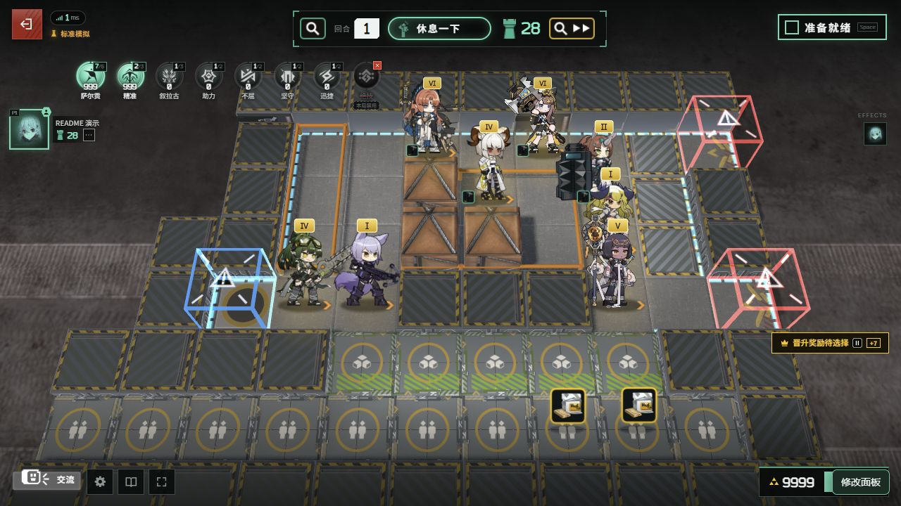

*本地实机演示：8 名干员已部署，萨尔贡与精准均设为 999 层，金币为 9999。这是使用修改器提前搭建的效果展示局，不是正常运营通关记录。*

**非官方同人扩展，仅供本地测试及个人非商业娱乐。禁止利用游戏素材盈利。** 游戏素材版权归鹰角网络 / Yostar 及相应权利人；本项目不包含本体和素材包，声明见 [NOTICE.md](NOTICE.md)。

| 可以做什么 | 怎么操作 |
| --- | --- |
| 设置金币 | 输入 0–99999，或点击 +100 / +1000 |
| 调整盟约叠层 | 选择本局允许的盟约，设置 0–999 层 |
| 免费获得物品 | 搜索、筛选后点击图标，每次获得一件 |
| 免费获得干员 | 列表自动排除本局被 ban 的干员，每次获得一名 |
| 修改自己 / AI 队友 | 在“修改对象”下拉框切换 |
| 一键启动与关闭 | 安装后使用本体目录内的专用快捷方式 |

<a id="install"></a>
## 图文安装教程

### 第 1 步：准备本体和修改器

| 需要准备 | 下载 / 检查方式 |
| --- | --- |
| Windows x64 | 当前图形安装器支持的系统 |
| 本体 **v0.1.3 完整包** | [本体 v0.1.3 发布页](https://github.com/sganggs/Stronghold-Protocol/releases/tag/v0.1.3)，下载 `Stronghold-Protocol-v0.1.3.zip` |
| Node.js **22 或 24** | [Node.js 官方下载](https://nodejs.org/zh-cn/download)；本体目录已有 `runtime/node.exe` 且版本符合要求时也可使用 |
| Chrome 或 Edge | 用于启动独立游戏窗口 |
| 修改器安装包 | [修改器 Releases](https://github.com/Doya16/Stronghold-Protocol-Trainer/releases/latest)，下载 `Stronghold-Protocol-Trainer-v0.2.0-win-x64.zip` |

打开修改器发布页，找到页面下方 **Assets**，选择名称以 **`win-x64.zip`** 结尾的附件。`Source code (zip)` 和 `Source code (tar.gz)` 是开发用源码，不是可以双击安装的成品。

<details>
<summary>查看下载位置截图（Assets 在页面底部）</summary>

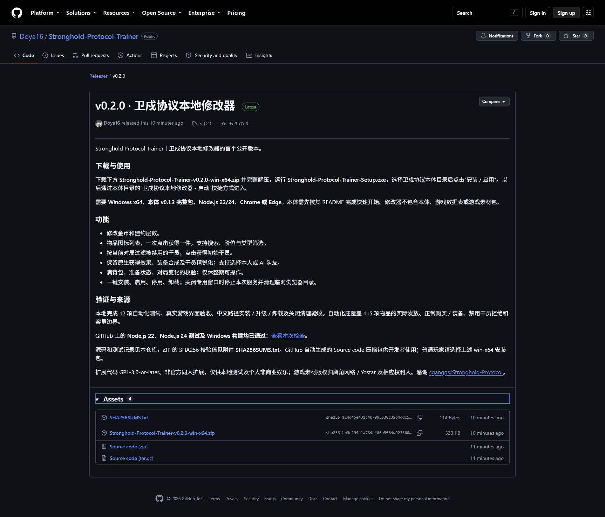

</details>

### 第 2 步：完整解压，确认本体能运行

把两个 ZIP 分别完整解压到普通文件夹；不要直接在压缩包预览里运行 EXE。建议使用短路径、可写目录，例如 `D:\Games\Stronghold-Protocol`，避免放在 OneDrive 同步目录中。

先阅读**本体自己的 `README.md` → 快速开始 → 整合包**，完成 Node.js 环境准备，并通过本体的 `scripts\start-windows.bat` 确认原版能打开。完整包已包含本体依赖与素材；修改器不会替你补下载这些内容。

**安装器要选择的是包含 `package.json` 的那一层。** 如果解压后套了两层同名文件夹，请继续进入内层。

```text
D:\Games\Stronghold-Protocol\       ← 安装器应填写这一层
├─ package.json
├─ README.md
├─ server\
├─ public\
├─ data\
├─ node_modules\
└─ scripts\

D:\Downloads\Stronghold-Protocol-Trainer-v0.2.0-win-x64\
└─ Stronghold-Protocol-Trainer-Setup.exe   ← 双击这个安装器
```

### 第 3 步：选目录，安装 / 启用

1. 关闭之前用于检查的游戏和服务窗口。
2. 双击 **`Stronghold-Protocol-Trainer-Setup.exe`**。
3. 粘贴本体根目录，或点 **浏览…** 选择它。下图路径是示例，请换成你自己的实际路径。
4. 点击 **安装 / 启用**，等待下方状态区提示成功，再点击 **启动游戏**。

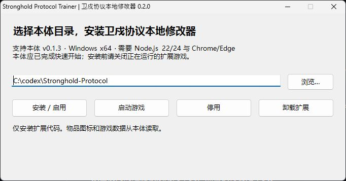

安装成功后，本体目录中会新增：

```text
sp-local-tools\                         ← 修改器文件
卫戍协议本地修改器 - 启动.lnk            ← 以后双击它进入
卫戍协议本地修改器 - 关闭并清理.lnk      ← 手动结束本次游戏并清理
```

无需管理员权限，但目录必须可写。安装器会检查本体版本、Node.js、浏览器和必要文件；提示缺失时，按提示补齐后重新安装即可。

### 第 4 步：从修改器入口打开游戏

第一次可直接点安装器的 **启动游戏**；以后双击本体目录里的 **卫戍协议本地修改器 - 启动** 快捷方式。

看到下图登录页后，输入博士代号，点击 **开始**。页面右下角出现“修改面板”，说明这次加载了扩展。

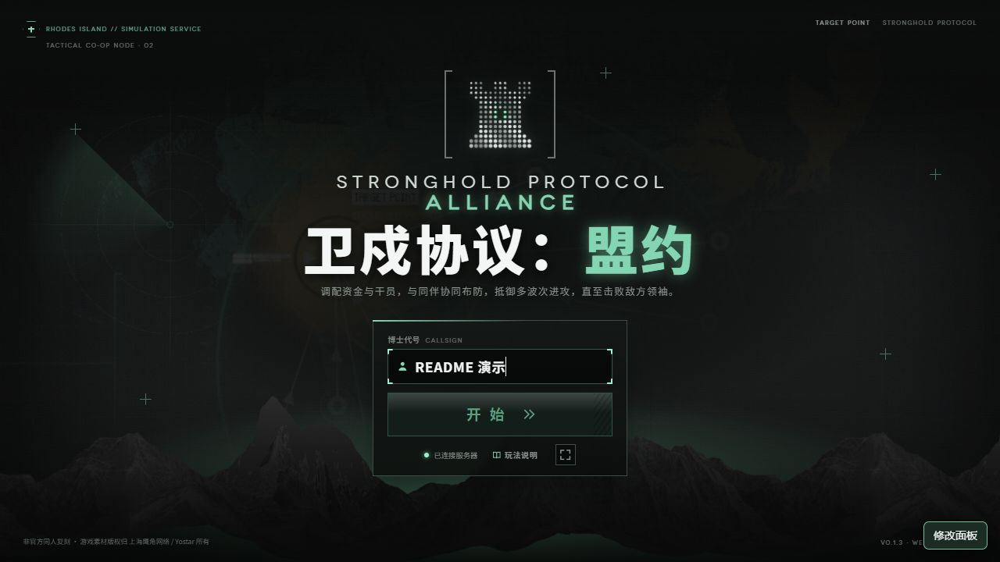

### 第 5 步：开局，进入休整期

初次体验可以选择 **独立模拟 → 标准模拟 → 开始独立模拟**。然后依次点击 **开始模拟 → 准备就绪 → 确认选择**，等画面顶部进入“休息一下”。

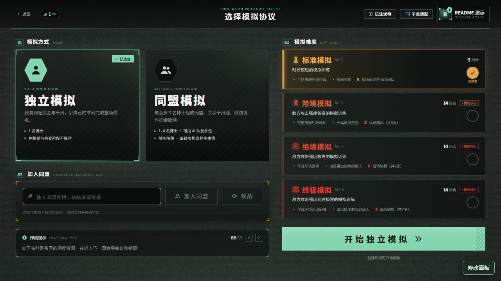

也可以使用同盟模拟添加 AI 队友。**本修改器入口仅监听本机 `127.0.0.1`**；本体的远程 / 局域网多人功能不等于本修改器提供远程修改能力。

### 第 6 步：打开面板并确认修改对象

点击右下角 **修改面板**，或按 **Ctrl + Shift + M**。确认上方状态为“第 … 回合 · 休整期”，并在“修改对象”中选中自己或目标 AI，再使用下面三个页签。

| 页签 | 最快上手方式 | 成功后看哪里 |
| --- | --- | --- |
| 数值 | 填写金币 → 设置金币；选择盟约 → 设为 999 层 | 面板底部成功提示、游戏资金和盟约栏 |
| 物品 | 筛选类型 / 阶位 → 点击物品图标 | 成功提示、整备区或暂存区 |
| 干员 | 搜索名字 → 点击干员头像 | 成功提示、整备区；已凑齐时会自动精锐化 |

准备就绪、战斗中或玩家已淘汰时不能修改。先取消准备，或等待下一轮休整期。

<a id="features"></a>
## 功能实机展示

以下截图来自 **本体 v0.1.3 + 修改器 v0.2.0** 的真实本地演示对局。截图中的数值、图标和成功提示均由游戏与修改器实际显示。

### 金币：即时设置，可继续正常消费

在“数值”页输入目标金额，点 **设置金币**；也可使用 **+100 金币 / +1000 金币**。资金会同步到游戏界面，之后购买、刷新和回合收入继续按原规则结算。

<details>
<summary>查看金币设置截图：10000 → 9999</summary>

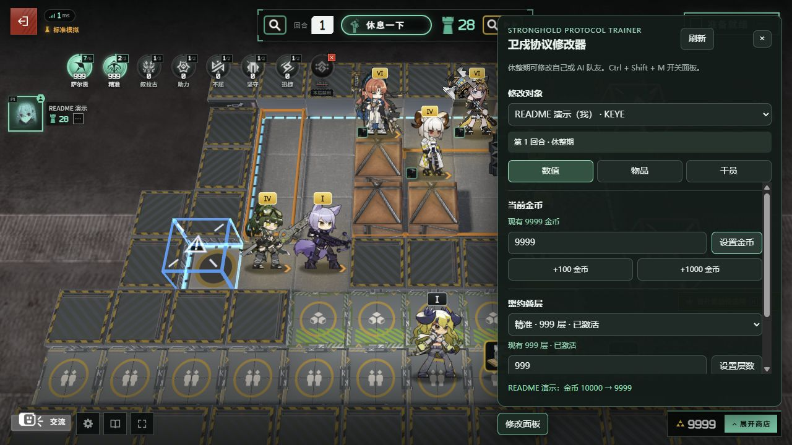

</details>

### 盟约：一键 999 层，游戏本身同步生效

选择盟约后点击 **设为 999 层**。下图中，面板底部显示“萨尔贡层数 8 → 999”，左上方**游戏自己的盟约栏也变为 999**。

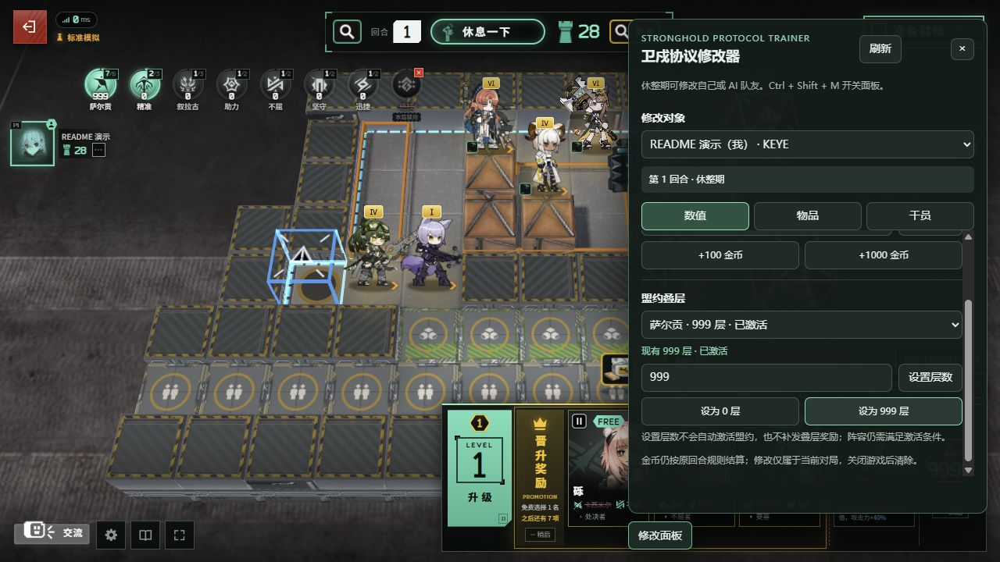

<details>
<summary>查看修改前与游戏原生盟约详情</summary>

修改前：萨尔贡已激活，当前为 8 层。

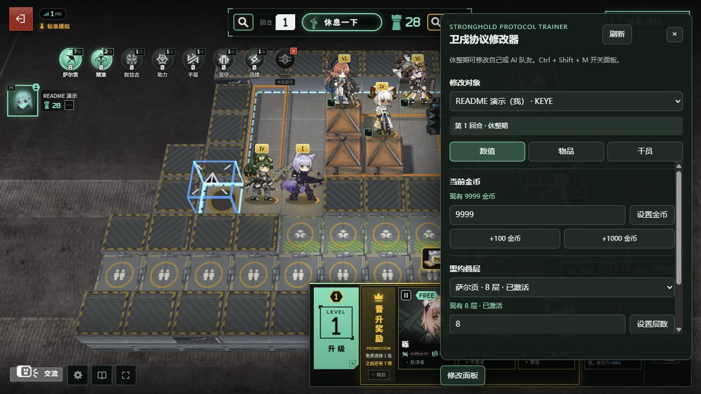

修改后：关闭修改面板，点游戏内“萨尔贡”图标，原生详情显示“层数 999”“已激活 · 2 阶”和对应当前效果。

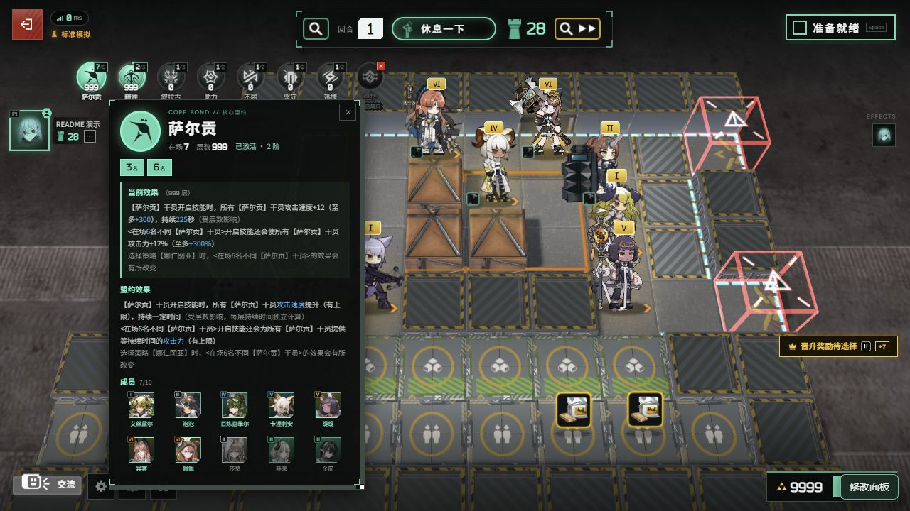

</details>

**层数和激活条件是两回事。** 设置 999 层不会自动把阵容补齐，也不会补发过去逐层叠加的奖励。请先让对应盟约达到激活条件，再看实际效果。

页首的展示阵容为：艾丝黛尔、泡泡、百炼嘉维尔、佩佩、普罗旺斯、卡涅利安、缇缇、异客。通过正常获得 / 合成流程准备干员，再部署到合法格子、配发装备；演示的是提前搭建阵容与修改层数，不代表自动摆阵或一键通关功能。

### 物品：点击图标获得一件

切到“物品”，按名称、ID 或描述搜索，或使用**阶位 + 普通装备 / 强化装备 / 道具**筛选。截图选择“1 阶 + 普通装备”，点击坚守盾牌后，底部显示“已获得 坚守盾牌 ×1”。

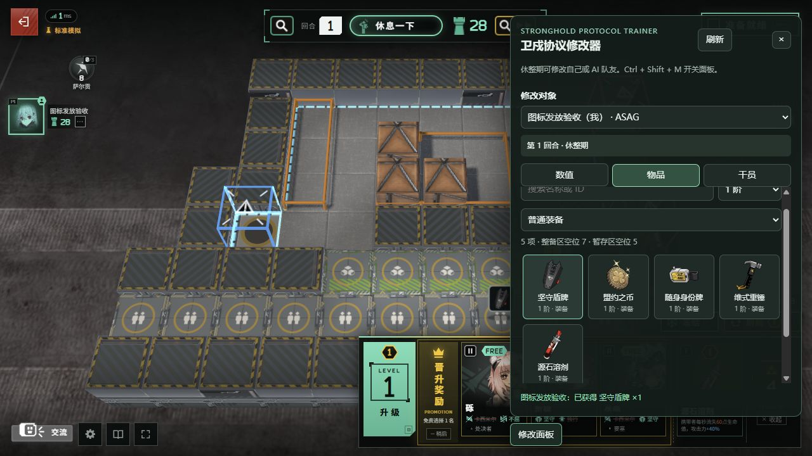

本体 v0.1.3 的列表共 115 项物品。每次点击发放一件，不扣金币；获得效果和自动合成仍由本体处理。装备拿到后仍要按游戏方式配发给干员，道具也要满足其使用条件。

### 干员：只显示本局未被 ban 的可获得干员

切到“干员”，搜索名字或筛选阶位，点击头像即可获得一名初始干员，不受当前商店等级限制。截图这局显示 **81 项，已排除 31 名禁用干员**；这是该演示局的数量，不是每局固定值。

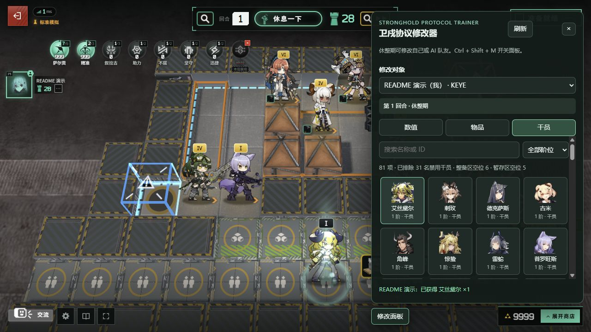

凑齐同名干员会按本体规则自动精锐化，可能出现晋升奖励。列表不直接发放精锐形态、召唤物或隐藏 / DIY 干员。获得后请自行从整备区拖到战场并选择朝向。

<a id="community"></a>
## 网上玩家的成型与满层参考

下面是**社区玩家在官方游戏中的阵容记录**，用于找搭配灵感；不是本修改器的测试记录。帖子所处活动期与本地复刻版本可能不同，具体干员、ban 位、装备和效果以你当前对局为准。

### 谢拉格 999 层成型记录

**[查看原帖截图：谢拉格 999 层 + 成型阵容记录](https://www.taptap.cn/moment/747932824320870144)**

来源：[《卫戍协议绝境稳定谢拉格999层》](https://www.taptap.cn/moment/747932824320870144)，TapTap **最后的光**，2025-12-10。图中可见谢拉格 999 层和该局阵容。原帖介绍三谢拉格搭配、冰冻与辅助的思路，也说明了地图限制；可对照原帖研究搭配，不把作者的成功率描述当作本项目保证。

### 大炎成员搭配参考

**[查看原帖配图：大炎成员及其他盟约的搭配思路](https://www.taptap.cn/moment/782716580197830151)**

来源：[《卫戍协议各个盟约个人攻略（无阿戈尔）》](https://www.taptap.cn/moment/782716580197830151)，TapTap **失忆的巴别塔恶灵**，页面标注修改于 03/18（2026 年活动期）。这张图展示大炎成员，不是 999 层结算；原帖还包含其他核心盟约的阵容思路。

更多满层截图：[《休露丝达成10满层盟约》](https://www.sina.cn/news/detail/5279638361215058.html)，**液電樂園**，2026-03-23。原帖展示多个 999 层盟约，其中助力标为 490，并非所有盟约都满层。该站图片有防盗链，请在来源页查看。

社区图片在 GitHub 的图片代理中无法正常加载，因此这里提供原帖看图入口；本页上方的实机图均随仓库保存，可直接查看。第三方图片及原作者内容不属于本项目 GPL 授权范围，详细来源与本地截图说明见 [截图来源](docs/SCREENSHOTS.md)。

## 游戏规则与边界

- 每次图标点击发放一件，优先进入整备区，满时进入暂存区。两处全满且无法合成时会拒绝并提示。
- 已有同类物品或干员可能立即自动合成，所以格子数量不一定增加；暂存区仍遵循本体清理规则。
- 共享卡池计数与本体获得流程保持一致；卡池耗尽时按本体效果赠送规则获得，不虚增可返还的份数。
- 禁用盟约不能设置层数；干员列表随对局重新过滤。换局或换回合后，旧请求会被拒绝。
- 修改只属于当前局。**关闭专用游戏窗口会结束本次服务并清理临时浏览器数据，不保留当前局存档。**

## 关闭、更新、停用与卸载

| 你想做什么 | 操作 | 结果 |
| --- | --- | --- |
| 正常退出 | 关闭专用游戏窗口 | 结束本次服务和浏览器进程，清理临时目录 |
| 手动结束并清理 | 双击“卫戍协议本地修改器 - 关闭并清理” | 清理本扩展管理的本次会话 |
| 更新修改器 | 先关闭游戏，新版安装器选择同一本体目录 → 安装 / 启用 | 更新独立扩展文件；运行中会阻止覆盖 |
| 暂时不用 | 安装器选择原目录 → 停用 | 禁止修改器入口启动；再次安装 / 启用即可恢复 |
| 删除扩展 | 安装器选择原目录 → 卸载扩展 | 移除扩展目录及属于扩展的两枚快捷方式，保留本体 |

扩展存放在 `sp-local-tools` 中，不修改本体源文件。原本体的启动脚本仍可使用；请区分它和修改器专用入口。

清理范围为 `sp-local-tools/runtime-data` 中本次浏览器配置、缓存和临时文件，以及扩展管理的进程。强制断电等异常退出的残留会在下次启动时清理；Windows 自身日志、系统预取等操作系统记录不在清理范围内。卸载时发现扩展目录里有用户额外文件，会保留并提示先移出。

## 常见问题

| 问题 | 处理方法 |
| --- | --- |
| 双击源码包找不到 EXE | 返回 Releases，下载 `win-x64.zip` 成品安装包 |
| 安装器说目录不正确 | 选择有 `package.json`、`server`、`public` 的本体根目录，检查是否多套了一层文件夹 |
| 提示本体版本不兼容 | 当前明确支持 v0.1.3；不要只改版本号绕过检查 |
| 没有修改面板 | 从“卫戍协议本地修改器 - 启动”进入；原版脚本不加载扩展 |
| 有按钮但不能修改 | 先确认对象、休整期、存活且未准备；读面板底部提示，再点“刷新” |
| 提示“对局已变化” | 换局或回合已切换，刷新面板后重新操作 |
| 改成 999 层但未激活 | 层数不会补齐阵容，请部署足够的对应盟约成员 |
| 点图标后看不到新卡 | 检查整备区、暂存区及自动合成结果；全满会明确拒绝 |
| 搜不到某名干员 | 确认筛选条件和本局 ban 位；召唤物、隐藏与精锐形态不会直接列出 |
| 图片空白或变成文字 | 确认使用带素材的本体完整包；缺图时仍可按名称点击 |
| 下一轮金币变化了 | 本体的收入结算仍然生效，在新休整期重新设置即可 |
| 重开游戏找不到上一局 | 这是专用入口的临时会话设计，退出时会结束对局并清理 |

反馈时请附：本体 / 修改器版本、进行到哪一步、面板底部完整提示、相关截图。可在 [Issues](https://github.com/Doya16/Stronghold-Protocol-Trainer/issues) 提交。

## 开发与测试

扩展无额外 npm 依赖，通过 `SP_GAME_ROOT` 指定外部本体目录。本体应已安装自己的依赖，并包含上游 `test/` 目录。

```powershell
$env:SP_GAME_ROOT = 'D:\Games\Stronghold-Protocol'
node --test test/local-tools.test.mjs test/live-match.test.mjs
powershell -ExecutionPolicy Bypass -File scripts/build.ps1
pwsh -File scripts/test-installer.ps1 -GameRoot $env:SP_GAME_ROOT
```

构建需要 Windows 自带 .NET Framework 4.x 编译器，生成安装器至 `dist/`。`Setup.Console.exe` 与图形安装器使用相同安装逻辑，供自动化验收；普通玩家无需使用。`scripts/release.ps1` 生成含文档的 ZIP 和 SHA256 校验文件。

已验证真实 WebSocket 登录、建房、开局、修改、购买和装备；115 项物品发放；禁用项、过期对局、容量、合成、AI 隔离与访问控制；中文路径安装、更新、启用、卸载及关闭清理。[v0.2.0 的 Node.js 22 / 24 测试与 Windows 构建均已通过](https://github.com/Doya16/Stronghold-Protocol-Trainer/actions/runs/37400324038)。详细范围见 [测试记录](docs/TESTING.md)，最新状态见 [Actions](https://github.com/Doya16/Stronghold-Protocol-Trainer/actions)。

## 许可与致谢

扩展代码采用 **GPL-3.0-or-later**，见 [LICENSE](LICENSE)。感谢 [sganggs/Stronghold-Protocol](https://github.com/sganggs/Stronghold-Protocol) 作者及测试贡献者，也感谢分享阵容思路的社区玩家。本体代码、依赖、游戏素材和第三方截图分别保留原有许可与权利声明；本项目不代表本体作者、配图作者或官方。
