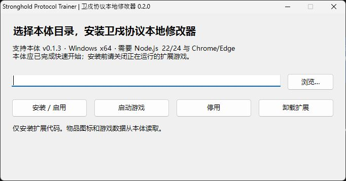

# Stronghold Protocol Trainer｜卫戍协议本地修改器

为 [卫戍协议：盟约 / Stronghold Protocol](https://github.com/sganggs/Stronghold-Protocol) 制作的独立本地修改器。输入本体目录即可安装，用图标列表免费获得物品和本局未被禁用的干员。

[下载安装包](https://github.com/Doya16/Stronghold-Protocol-Trainer/releases/latest) · [反馈问题](https://github.com/Doya16/Stronghold-Protocol-Trainer/issues) · [自动化测试](https://github.com/Doya16/Stronghold-Protocol-Trainer/actions)

**非官方同人扩展，仅供本地测试及个人非商业娱乐。游戏素材版权归鹰角网络 / Yostar 及相应权利人。** 本项目不打包本体与游戏素材，声明见 [NOTICE.md](NOTICE.md)。

## 功能

- 设置当前金币、增加 100 / 1000 金币。
- 设置可叠层盟约的层数，范围 0–999；禁用盟约不可修改。
- 物品图标列表：点击获得一件，支持名称 / ID / 描述搜索、阶位和类型筛选。包含普通装备、强化装备、道具。
- 干员图标列表：按**当前对局**过滤被 ban 的干员，点击获得一名初始干员；不受商店等级限制。
- 使用游戏原有获得流程，保留获得效果、自动合成、干员精锐化及共享卡池计数；金币不会因发放而扣除。
- 可选择自己或本机 AI 队友。仅休整期、存活且未准备的玩家可操作。
- 独立浏览器窗口；关闭时停止本次服务并清除本次浏览器配置、缓存及临时数据。
- 安装 / 启用、停用、卸载。扩展存放于独立目录，不修改本体源文件。


## 快速开始（Windows）

1. 先下载本体 **v0.1.3 完整包**，按其 README 完成快速开始，确认原版能启动。
2. 安装 **Node.js 22 或 24**，并准备 Chrome 或 Edge。本体自带 `runtime/node.exe` 时也可使用。
3. 从本仓库 [Releases](https://github.com/Doya16/Stronghold-Protocol-Trainer/releases/latest) 下载 `Stronghold-Protocol-Trainer-v0.2.0-win-x64.zip`，完整解压。
4. 双击 `Stronghold-Protocol-Trainer-Setup.exe`，输入或浏览选择**本体根目录**，其中应有 `package.json`、`server`、`public` 等。
5. 点击 **安装 / 启用**，再点击 **启动游戏**。以后直接双击本体目录里的 **卫戍协议本地修改器 - 启动.lnk** 即可。
6. 开局进入休整期后，点击右下角“修改面板”，或按 **Ctrl + Shift + M**。先确认修改对象，再选择数值 / 物品 / 干员。



当前支持 Windows x64、本体 v0.1.3。其他本体版本会提示不兼容，以免将修改写入不同结构的游戏状态。安装器不自动下载本体、依赖或素材；缺失时会指出需要先完成的步骤。不需要管理员权限，但本体目录必须可写。

## 游戏规则与限制

- 图标每次点击发放**一件**。优先放入整备区，满时使用暂存区；两处全满且无法合成时拒绝发放并提示，不会静默丢失这次请求的物品。
- 暂存区仍遵循本体的清理规则；已有同类装备或干员可能立即自动合成，因此格子数量不一定增加。
- 干员列表只列出本局可用的常规初始干员，不包含召唤物、隐藏 / DIY 干员和直接精锐形态。连续获得会按原规则精锐化。卡池耗尽时按本体效果赠送的规则获得，不虚增可返还的卡池份数。
- 设置盟约层数不会自动满足阵容激活条件，也不会补发历史叠层奖励。
- 本体回合收入、装备使用条件和上限保持原规则。点过“准备就绪”后，先取消准备再修改。
- 服务只监听 `127.0.0.1`，面板用于本机游戏，不用于加入他人服务器或对外开服。
- 当前局、代号和浏览器设置均为临时内容，关闭后不保留存档。

## 更新、停用与卸载

更新前先结束当前对局并关闭修改器游戏，再运行新版安装器，选择同一本体目录后点击“安装 / 启用”。安装器会阻止覆盖正在运行的扩展。

“停用”会禁止修改器入口启动；再次“安装 / 启用”即可恢复。原本体的启动方式始终可用，原版入口不会加载本扩展。请注意区分原版快捷方式和修改器快捷方式。

“卸载扩展”移除 `sp-local-tools` 目录和属于本扩展的两枚快捷方式，保留本体文件。若目录里有用户额外存放的文件，会保留并要求先移出，不直接删除。

正常关闭游戏窗口会清理 `sp-local-tools/runtime-data`。需要手动关闭时可使用 **卫戍协议本地修改器 - 关闭并清理.lnk**。强制断电等异常退出留下的临时目录会在下次启动时清理。这里的清理范围是本扩展管理的进程和临时目录，不包含 Windows 自身日志、系统预取等操作系统记录。

## 常见问题

**没有物品图标？** 确认使用的是包含素材的本体完整包。图片缺失会用名称首字替代，仍可点击。

**没有修改面板？** 请从“卫戍协议本地修改器 - 启动”进入；原版入口不加载修改器。

**提示对局已变化？** 当前局或回合已经变化，点击刷新后重试。旧请求不会自动写入新对局。

**金币下一轮变了？** 本体仍会按原有收入规则结算；可在新一轮休整期再设置。

**“休整期可修改”但按钮灰色？** 检查玩家是否已准备、淘汰，以及面板是否提示需要重启新版服务。

## 开发与测试

扩展无额外 npm 依赖，通过 `SP_GAME_ROOT` 指定外部本体目录。本体应已安装自己的依赖，并包含上游 `test/` 目录。

```powershell
$env:SP_GAME_ROOT = 'D:\Games\Stronghold-Protocol'
node --test test/local-tools.test.mjs test/live-match.test.mjs
powershell -ExecutionPolicy Bypass -File scripts/build.ps1
pwsh -File scripts/test-installer.ps1 -GameRoot $env:SP_GAME_ROOT
```

构建需要 Windows 自带 .NET Framework 4.x 编译器，生成安装器至 `dist/`。`Setup.Console.exe` 与图形安装器使用完全相同的安装逻辑，供自动化验收；不需要将它分发给普通玩家。`scripts/release.ps1` 生成可分享 ZIP 和 SHA256 校验文件。

测试包括真实 WebSocket 登录、建房、开局、修改、购买和装备操作；禁用项、过期对局、背包容量、正常合成、AI 隔离和接口访问控制；以及中文路径的安装、升级、启用、卸载。详细验收见 [docs/TESTING.md](docs/TESTING.md)。

## 许可与致谢

扩展代码采用 **GPL-3.0-or-later**，见 [LICENSE](LICENSE)。感谢 [sganggs/Stronghold-Protocol](https://github.com/sganggs/Stronghold-Protocol) 作者及测试贡献者。本体自己的代码、依赖、游戏素材分别保留原有许可与声明；本项目不代表本体作者或官方。
